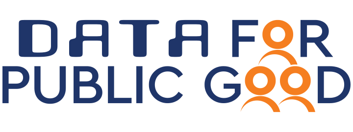

# Contributor code of conduct

Trust, respect, collaboration and transparency are core
values we believe should live and breathe within our projects. Our community welcomes participants from around the world with different experiences, unique perspectives, and great ideas to share.
When you're working with members of the community, this Code of Conduct will help steer your interactions and keep CDPG a positive, successful, and growing community.

## Our pledge
The CDPG as an open-source community is **open**, **kind**, **inquisitive**, **respectful**

- **Being open**: Members of the community are open to collaboration
- **Focusing on what is best for the community**: We're respectful of the processes set forth in the community, and we work within them
- **Acknowledging time and effort**: We're respectful of the volunteer efforts that permeate the CDPG community and we're thoughtful when addressing the efforts of others, keeping in mind that often times the labor was completed simply for the good of the community
- **Being respectful of differing viewpoints and experiences**. We're receptive to constructive comments and criticism, as the experiences and skill sets of other members contribute to the whole of our efforts
- **Showing empathy towards other community members**. We're attentive in our communications, whether in person or online, and we're tactful when approaching differing views
- **Being considerate**. Members of the community are considerate of their peers
- **Being respectful**. We're respectful of others, their positions, their skills, their commitments, and their efforts
- **Gracefully accepting constructive criticism**. When we disagree, we are courteous in raising our issues
- **Using welcoming and inclusive language**. We're accepting of all who wish to take part in our activities, fostering an environment where anyone can participate and everyone can make a difference

## Our standards
This Code of Conduct will help inform your interactions and reinforce values that contribute to a positive environment

### Expected behavior 
- Be welcoming. Use inclusive language
- Be respectful of differing viewpoints and experiences
- Be receptive to constructive comments and criticism
- Show empathy towards other community members
- Be respectful of others' positions, skills, commitments, and efforts

### Inappropriate behavior
- Trolling, insulting/derogatory comments, and personal or political attacks
- The use of sexualized language or imagery. Unwelcome sexual attention or advances
- Language or imagery that encourages, glorifies, incites, or calls for violence, emotional, or physical harm against an individual or a group of people
- Public or private harassment
- Personal insults, especially those using racist, ableist, ageist, homophobic, or sexist terms
- Defaming an individual or group, or violating any trademarks or copyrighted material
- Publishing private or identifying information or non-harassing communication without explicit permission
- Dismissing or attacking inclusion-oriented requests
- Continual disruption of talks, workshops, or other events
- Offensive comments related to race/ethnicity or national origin, sex or gender, gender identity and expression, sexual orientation, disability, physical appearance, mental illness or neurotypicality, body size, caste, age, or religion
- Threats or acts of violence
- Deliberate intimidation
- Encouraging any of the above behavior

### Reporting the behavior
If you believe that someone is violating the code of conduct, or have any other concerns, please contact
our team immediately by sending an email to support@iudx.org.in. All reports will be reviewed and investigated and will result in a response that is deemed necessary and appropriate to the circumstances.

## Attribution
This Code of Conduct is adapted from the [Opensource.com](https://opensource.com/code-of-conduct), [Python code of conduct](https://policies.python.org/python.org/code-of-conduct/).

