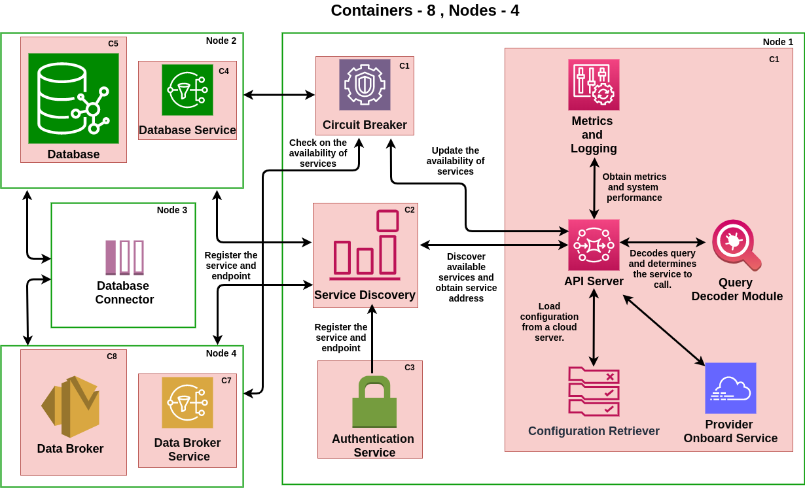
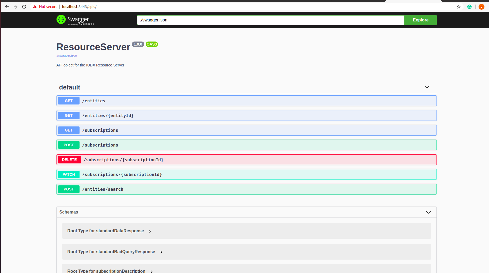

# iudx-resource-server
<!--
*** Thanks for checking out this README Template. If you have a suggestion that would
*** make this better, please fork the repo and create a pull request or simply open
*** an issue with the tag "enhancement".
*** Thanks again! Now go create something AMAZING! :D
***
***
***
*** To avoid retyping too much info. Do a search and replace for the following:
*** github_username, repo, twitter_handle, email
-->


<!-- PROJECT SHIELDS -->
<!--
*** I'm using markdown "reference style" links for readability.
*** Reference links are enclosed in brackets [ ] instead of parentheses ( ).
*** See the bottom of this document for the declaration of the reference variables
*** for contributors-url, forks-url, etc. This is an optional, concise syntax you may use.
*** https://www.markdownguide.org/basic-syntax/#reference-style-links
-->

[![Contributors][contributors-shield]][contributors-url]
[![Forks][forks-shield]][forks-url]
[![Issues][issues-shield]][issues-url]
[![MIT License][license-shield]][license-url]
[![IUDX][iudx-shield]][iudx-url]


<!-- PROJECT LOGO -->
<br />
<p align="center">
  <a href="https://github.com/datakaveri/iudx-resource-server">
    
  </a>

  <h3 align="center">IUDX Resource Server</h3>
</p>

<!-- TABLE OF CONTENTS -->
## Table of Contents

* [About the Project](#about-the-project)
* [Getting Started](#getting-started)
  * [Prerequisites](#prerequisites)
  * [Usage](#usage)
* [Contributing](#contributing)
* [License](#license)


<!-- ABOUT THE PROJECT -->
## About The Project

The Ministry of Housing and Urban Affairs (MoHUA) launched an ambitious program for the development of 100 Smart Cities aimed at catalyzing investments in holistic infrastructure and services, development of integrated approaches to problem solving, promotion of co-creation and bottom-up innovation using technology, and creation of sustainable outcomes by espousing the circular economy and participatory processes built around communities.

This repository has the IUDX Resource Server Service implemented using Vert.x, an event driven and non-blocking high performance reactive tool-kit, for identifying assets and data resources in Smart Cities. The resource server uses Hazlecast Cluster Manager to support Scalability and High Availability. It uses Circuit Breaker for Fault Tolerence. It follows the principles of Service Mesh Architecture, where each service is exposed to the client using a Service Proxy. The code is developed using Java and dependencies are managed using Maven. We follow google codestyle, checkstyle, PMD and CPD to ensure coding discipline and document the code using java docs. 

<br />
<p align="center">
  <a href="https://github.com/datakaveri/iudx-resource-server">
    
  </a>
</p>

<!-- GETTING STARTED -->
## Getting Started

To get a local copy up and running follow these simple steps.

### Prerequisites
* Java
```sh
sudo apt install openjdk-13-jdk
```
* Maven
```sh
sudo apt install maven
```
<!-- USAGE EXAMPLES -->
### Usage

The Project Object Model (pom.xml) contains all the dependencies. It has all the execution modes for starting the server or a single node to a cluster. 
The server can be started using the following command 

```sh
mvn clean compile exec:java@resource-server
```

This will start the server with the modules, and will be available to serve at https://localhost:8443
You can look at the APIs supported using the /apis/ page of the server. This (https://localhost:8443/apis/) will open a swagger page as shown below 

<br />
<p align="center">
  <a href="https://github.com/datakaveri/iudx-resource-server">
    
  </a>
</p>

In order to scale, you can start a node with a specific module and join to the cluster using the deployer ID available in POM. For example, you can start another database service using the following command

```sh
mvn clean compile exec:java@resource-server-database-service
```

<!-- CONTRIBUTING -->
## Contributing

Contributions are what make the open source community such an amazing place to be learn, inspire, and create. Any contributions you make are **greatly appreciated**.

1. Fork the Project
2. Create your Feature Branch (`git checkout -b feature/AmazingFeature`)
3. Commit your Changes (`git commit -m 'Add some AmazingFeature'`)
4. Push to the Branch (`git push origin feature/AmazingFeature`)
5. Open a Pull Request

<!-- LICENSE -->
## License

Distributed under the MIT License. See `LICENSE` for more information.

<!-- MARKDOWN LINKS & IMAGES -->
<!-- https://www.markdownguide.org/basic-syntax/#reference-style-links -->
[contributors-shield]: https://img.shields.io/github/contributors/othneildrew/Best-README-Template.svg?style=flat-square
[contributors-url]: https://github.com/datakaveri/iudx-resource-server/graphs/contributors
[forks-shield]: https://img.shields.io/github/forks/othneildrew/Best-README-Template.svg?style=flat-square
[forks-url]: https://github.com/datakaveri/iudx-resource-server/network/members
[issues-shield]: https://img.shields.io/github/issues/othneildrew/Best-README-Template.svg?style=flat-square
[issues-url]: https://github.com/datakaveri/iudx-resource-server/issues
[license-shield]: https://img.shields.io/github/license/othneildrew/Best-README-Template.svg?style=flat-square
[license-url]: https://github.com/datakaveri/iudx-resource-server/blob/master/LICENSE.txt
[iudx-shield]: https://img.shields.io/badge/-LinkedIn-black.svg?style=flat-square&logo=linkedin&colorB=555
[iudx-url]: https://www.iudx.org.in/
[product-screenshot]: readme/images/iudx.png
