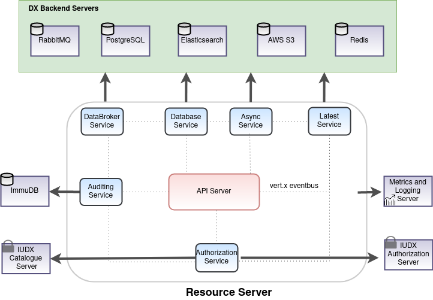

[](https://jenkins.iudx.io/view/iudx-v5.5.0/job/iudx%20RS%20(v5.5.0)%20pipeline/lastBuild/)
[](https://jenkins.iudx.io/view/iudx-v5.5.0/job/iudx%20RS%20(v5.5.0)%20pipeline/lastBuild/jacoco/)
[](https://jenkins.iudx.io/view/iudx-v5.5.0/job/iudx%20RS%20(v5.5.0)%20pipeline/lastBuild/testReport/)
[](https://jenkins.iudx.io/view/iudx-v5.5.0/job/iudx%20RS%20(v5.5.0)%20pipeline/lastBuild/performance/)
[](https://jenkins.iudx.io/view/iudx-v5.5.0/job/iudx%20RS%20(v5.5.0)%20pipeline/lastBuild/zap/)


# iudx-resource-server

The resource server is [IUDXs](https://iudx.org.in) data discovery, data publication and data subscription portal.
It allows data providers to publish their data *resources* in accordance to the IUDX vocabulary annotated meta-data document,  data subscribers to query and subscribe for data *resources* as per the consent of the provider.
The consumers can access data from the resource server using HTTPs and AMQPs.

<p align="center">

</p>


## Features

- Provides data access from available resources using standard APIs, streaming subscriptions (AMQP) and/or callbacks
- Search and count APIs for searching through available data: Support for Spatial (Circle, Polygon, Bbox, Linestring), Temporal (Before, during, After) and Attribute searches
- Adaptor registration endpoints and streaming endpoints for data ingestion
- Integration with authorization server (token introspection) to serve private data as per the access control policies set by the provider
- End to End encryption supported using certificate
- Secure data access over TLS
- Scalable, service mesh architecture based implementation using open source components: Vert.X API framework, Elasticsearch/Logstash for database and RabbitMQ for data broker.
- Hazelcast and Zookeeper based cluster management and service discovery
- Integration with auditing server for metering purpose

## API Docs 
The api docs can be found [here](https://rs.iudx.org.in/apis).

## Prerequisites 
### External Dependencies Installation 

The Resource Server connects with various external dependencies namely
- ELK stack 
- PostgreSQL
- RabbitMQ
- Redis
- AWS S3

Find the installations of the above along with the configurations to modify the database url, port and associated credentials in the appropriate sections
 [here](SETUP.md)

## Get Started

### Docker based
1. Install docker and docker-compose
2. Clone this repo
3. Build the images 
   ` ./docker/build.sh`
4. Modify the `docker-compose.yml` file to map the config file you just created
5. Start the server in production (prod) or development (dev) mode using docker-compose 
   ` docker-compose up prod `


### Maven based
1. Install java 11 and maven
2. Use the maven exec plugin based starter to start the server 
   `mvn clean compile exec:java@resource-server`
   
### JAR based
1. Install java 11 and maven
2. Set Environment variables
```
export RS_URL=https://<rs-domain-name>
export LOG_LEVEL=INFO
```
3. Use maven to package the application as a JAR
   `mvn clean package -Dmaven.test.skip=true`
4. 2 JAR files would be generated in the `target/` directory
   - `iudx.resource.server-cluster-0.0.1-SNAPSHOT-fat.jar` - clustered vert.x containing micrometer metrics
   - `iudx.resource.server-dev-0.0.1-SNAPSHOT-fat.jar` - non-clustered vert.x and does not contain micrometer metrics

#### Running the clustered JAR

**Note**: The clustered JAR requires Zookeeper to be installed. Refer [here](https://zookeeper.apache.org/doc/r3.3.3/zookeeperStarted.html) to learn more about how to set up Zookeeper. Additionally, the `zookeepers` key in the config being used needs to be updated with the IP address/domain of the system running Zookeeper.

The JAR requires 3 runtime arguments when running:

* --config/-c : path to the config file
* --hostname/-i : the hostname for clustering
* --modules/-m : comma separated list of module names to deploy

e.g. `java -jar target/iudx.resource.server-cluster-0.0.1-SNAPSHOT-fat.jar  --host $(hostname) -c configs/config.json -m iudx.resource.server.database.archives.DatabaseVerticle,iudx.resource.server.authenticator.AuthenticationVerticle 
,iudx.resource.server.metering.MeteringVerticle,iudx.resource.server.database.postgres.PostgresVerticle`

Use the `--help/-h` argument for more information. You may additionally append an `RS_JAVA_OPTS` environment variable containing any Java options to pass to the application.

e.g.
```
$ export RS_JAVA_OPTS="-Xmx4096m"
$ java $RS_JAVA_OPTS -jar target/iudx.resource.server-cluster-0.0.1-SNAPSHOT-fat.jar ...
```

#### Running the non-clustered JAR
The JAR requires 1 runtime argument when running:

* --config/-c : path to the config file

e.g. `java -Dvertx.logger-delegate-factory-class-name=io.vertx.core.logging.Log4j2LogDelegateFactory -jar target/iudx.resource.server-dev-0.0.1-SNAPSHOT-fat.jar -c configs/config.json`

Use the `--help/-h` argument for more information. You may additionally append an `RS_JAVA_OPTS` environment variable containing any Java options to pass to the application.

e.g.
```
$ export RS_JAVA_OPTS="-Xmx1024m"
$ java $RS_JAVA_OPTS -jar target/iudx.resource.server-dev-0.0.1-SNAPSHOT-fat.jar ...
```


### Testing  
  
### Unit tests  
1. Run the tests using `mvn clean test checkstyle:checkstyle pmd:pmd`  
2. Reports are stored in `./target/`  
  
  
### Integration tests  
Integration tests are through Rest Assured  
1. Run the server through either docker, maven or redeployer  
2. Run the integration tests `mvn test-compile failsafe:integration-test -DskipUnitTests=true -DintTestHost=local  
host -DintTestPort=8080`  
3. Reports are stored in `./target/`

### Encryption
All the count and search APIs have a feature to get encrypted data.
To get the data in encrypted format, the user could provide a `publicKey` in the header, with the value that is generated from [lazySodium sealed box](https://github.com/terl/lazysodium-java/wiki/Getting-started). 
The header value should be in _url-safe base64 format_. 
The encrypted data could be decrypted using the lazysodium sealed box by supplying the private and public key.


## Contributing
We follow Git Merge based workflow 
1. Fork this repo
2. Create a new feature branch in your fork. Multiple features must have a hyphen separated name, or refer to a milestone name as mentioned in Github -> Projects 
3. Commit to your fork and raise a Pull Request with upstream

## License
[View License](./LICENSE)
