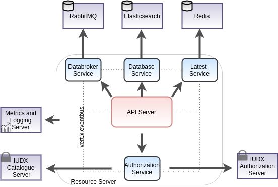

%20pipeline/lastBuild/)
%20pipeline/lastBuild/jacoco/)
%20pipeline/lastBuild/testReport/)
%20pipeline/lastBuild/performance/)
%20pipeline/lastBuild/zap/)
%20pipeline/HTML_20Report/)

# iudx-resource-server

The resource server is [IUDXs](https://iudx.org.in) data discovery, data publication and data subscription portal.
It allows data providers to publish their data *resources* in accordance to the IUDX vocabulary annotated meta-data document,  data subscribers to query and subscribe for data *resources* as per the consent of the provider.
The consumers can access data from the resource server using HTTPs and AMQPs.

## Features

- Provides data access from available resources using standard APIs, streaming subscriptions (AMQP) and/or callbacks
- Search and count APIs for searching through available data: Support for Spatial (Circle, Polygon, Bbox, Linestring), Temporal (Before, during, After) and Attribute searches
- Adaptor registration endpoints and streaming endpoints for data ingestion
- Integration with authorization server (token introspection) to serve private data as per the access control policies set by the provider
- Secure data access over TLS
- Scalable, service mesh architecture based implementation using open source components: Vert.X API framework, Elasticsearch/Logstash for database and RabbitMQ for data broker.
- Hazelcast and Zookeeper based cluster management and service discovery

## API Docs 
The api docs can be found [here](https://rs.iudx.org.in/apis).

## Get Started

### Prerequisite - Make configuration
Make a config file based on the template in `./configs/config-example.json` 
- Generate a certificate using Lets Encrypt or other methods
- Make a Java Keystore File and mention its path and password in the appropriate sections
- Modify the database url and associated credentials in the appropriate sections

### Docker based
1. Install docker and docker-compose
2. Clone this repo
3. Build the images 
   ` ./docker/build.sh`
4. Modify the `docker-compose.yml` file to map the config file you just created
5. Start the server in production (prod) or development (dev) mode using docker-compose 
   ` docker-compose up prod `

### Maven based
1. Install java 13 and maven
2. Use the maven exec plugin based starter to start the server 
   `mvn clean compile exec:java@resource-server`

### Testing

### Unit tests
1. Run the server through either docker, maven or redeployer
2. Run the unit tests and generate a surefire report 
   `mvn clean test-compile surefire:test surefire-report:report`
3. Reports are stored in `./target/`

### Integration tests
Integration tests are through Postman/Newman whose script can be found from [here](./src/test/resources/IUDX-Resource-Server-Release-v2.0.postman_collection.json).
1. Install prerequisites 
   - [postman](https://www.postman.com/) + [newman](https://www.npmjs.com/package/newman)
   - [newman reporter-htmlextra](https://www.npmjs.com/package/newman-reporter-htmlextra)
2. Example Postman environment can be found [here](./configs/postman-env.json)
3. Run the server through either docker, maven or redeployer
4. Run the integration tests and generate the newman report 
   `newman run <postman-collection-path> -e <postman-environment> --insecure -r htmlextra --reporter-htmlextra-export .`
5. Reports are stored in `./target/`

## Contributing
We follow Git Merge based workflow 
1. Fork this repo
2. Create a new feature branch in your fork. Multiple features must have a hyphen separated name, or refer to a milestone name as mentioned in Github -> Projects 
3. Commit to your fork and raise a Pull Request with upstream

## License
[MIT](./LICENSE.txt)
