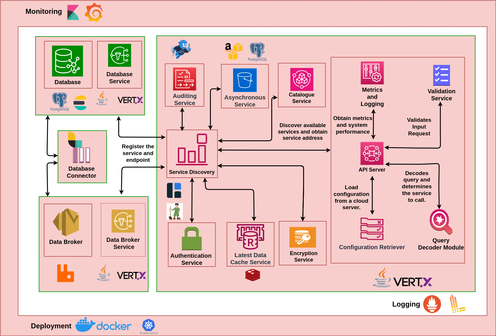

## Solution Architecture

The DX Resource Server is designed to scale easily for high-demand services. Below is an overview of its components:

### API Server
The API server acts as the main gateway, facilitating
HTTPs communication between various actors (providers, consumers, DX Cat Server, DX AAA Server) 
and services like the database, data broker, async service, cache, and encryption services. 
It also communicates with the DX AAA Server for token-based authentication and access control, ensuring secure resource interaction.
The APIs, wherever applicable, of the resource server, are implemented as per the specification of NGSI-LD.

### Database Module
The Database Search Service is called by the API Server to serve consumer data requests. Consumers may request for data by querying for it in accordance with the NGSI-LD specification.

A number of search queries are supported including -
- Attribute search - searches and retrieves data based on attribute or key-value pairs whose values maybe text or numeric attributes (such as name, licence-plate-number, etc)
- Geo-Spatial search - searches and retrieves data based on geo-spatial queries which may be a circle, a bounding box, a polygon or a line string
- Text search -  searches and retrieves data based on a free text search
- Complex search - searches and retrieves data based on a combination of an attribute search, a geo-spatial search and a text search

Responses from these queries may additionally be filtered out to make the data more manageable using filters on the attributes contained in the data.

### Postgres Module
This module relies on a PostgreSQL database to store and manage data for services such as auditing, caching, and async processes. Each service interacts with the database to maintain its data efficiently.

### Databroker Module
The Data Broker Service is used by the API Server to interact with the data broker to create, update, delete exchanges, queues and subscriptions for users, and it also manages queue for service like auditing.
The ancillary services handled by the data broker service to facilitate subscription of data are -
- Create Exchange - Facilitates creation of an exchange into which adaptors, sensor-gateway or sensors can publish data
- Delete Exchange - Facilitates deletion of an exchange
- Create Queue - Facilitates the deletion queues to which data published into an exchange are queued for subscription
- Delete Queue - Facilitates deletion of a queue
- Create Subscription - Facilitates the creation of subscription between a sender (exchange) and a receiver (queue) based on a topic or ID
- Update Subscription - Facilitates the update of an existing subscription between a sender (exchange) and a receiver (queue) based on a topic or ID
- Delete subscriptions - Facilitates the deletion or unbinds a topic or ID in the consumer [a receiver (queue)] from a sender (exchange)

### Auditing Service
The auditing service ensures comprehensive tracking and logging of resource server operations. Integrated with the data broker, it uses message queues to track API interactions, helping in assessing the success or failure of endpoint requests.

### Authentication Service
This service interacts with the DX AAA Server to validate user tokens. Based on the tokens, it retrieves user roles and access policies, ensuring the correct authorization for each request.

### Catalogue Service
The catalogue service provides essential metadata for other services, such as the auth and cache services, facilitating resource discovery and management across the platform.

### Encryption Service
All the count and search APIs have a feature to get encrypted data.
To get the data in encrypted format, the user could provide a `publicKey` in the header, with the value that is generated from [lazySodium sealed box](https://github.com/terl/lazysodium-java/wiki/Getting-started).
The header value should be in _url-safe base64 format_.
The encrypted data could be decrypted using the lazysodium sealed box by supplying the private and public key.

### Async Service
The async service allows users to make API requests for resources over extended time periods and larger geographic areas. By processing these requests asynchronously, it ensures that the system remains responsive, even when handling large or complex data queries, and users can retrieve results once the processing is complete.

### Database Connector
The database connector Service routes between the data broker (to which streaming data may be published) and the database (where the data will be stored).

### Latest Service
The Latest Service retrieves latest data from Redis, providing users with quick access to current data. By using Redis, the service ensures fast response times, enhancing the overall efficiency of data retrieval.